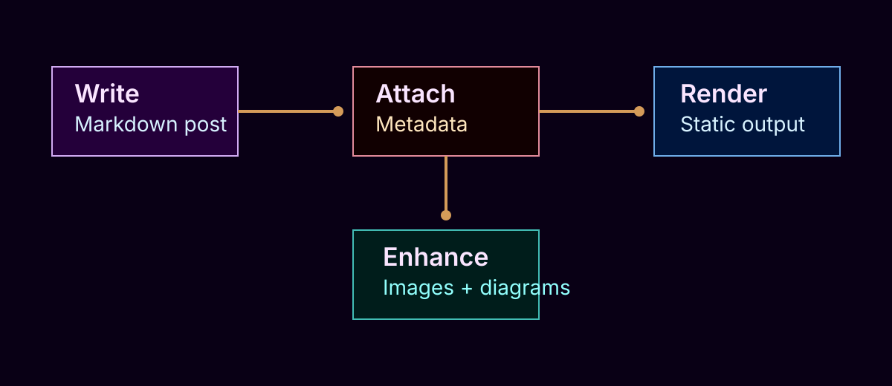
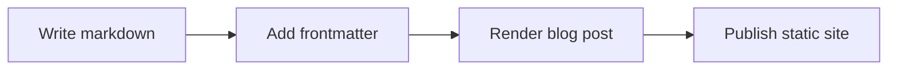

This blog reads markdown files from `content/posts` and turns each one into an individual post view.

## Frontmatter

Every post can start with YAML frontmatter for metadata:

```yaml
---
title: My first post
date: 2026-05-19
tags:
  - writing
  - setup
description: A short summary for cards and previews.
---
```

## Syntax-highlighted code blocks

Standard fenced code blocks are highlighted automatically:

```js
const posts = ['first-post', 'another-post'];

for (const slug of posts) {
  console.log(`Rendering ${slug}`);
}
```

## Images

Markdown images work inside posts, including images stored alongside your content files:



## Mermaid diagrams

Mermaid fenced blocks render as diagrams:



## Writing flow

1. Add a new markdown file in `content/posts`.
2. Include your frontmatter fields.
3. Write normal markdown for the article body.
4. Start the dev server or run a production build.

That is all you need to publish another post.
